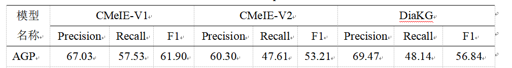

# AGP-master
# 基于对抗训练与全局指针网络的医疗文本实体关系联合抽取模型

## 目录
- [概述](#概述)
- [项目结构](#项目结构)
- [基本原理](#基本原理)
- [环境要求](#环境要求)
- [数据集](#数据集)
- [运行](#运[main.py](main.py)行)
- [实验结果](#实验结果)
- [引用](#引用)

## 概述(背景、目的)

关系抽取作为医疗、金融、教育等领域文本理解任务的核心一直备受关注，医疗文本具有知识密集、术语结构复杂、句法形式灵活多样的特点，实体嵌套、关系重叠、长尾关系等现象非常普遍。
本研究在比较分析现有关系抽取方法的基础上，选择全局指针网络作为解码器，并利用Transformer编码器和对抗训练增强对文本特征的提取。

## 项目结构
```
├── data                          # 存储各类数据集。
│   ├── CMeIE-V1                  # CMeIE-V1数据集。
│   ├── CMeIE-V2                  # CMeIE-V2数据集。
│   └── DiaKG                     # DiaKG数据集。
├── log                           # 存储生成的log文件。
├── model                         # 核心代码库。
│   ├── attack_train.py           # 对抗学习方法。
│   ├── data_generator.py         # 数据生成函数。
│   ├── erenet.py                 # 三元组编码。
│   ├── globalpointer.py          # 全局指针网络。
│   └── loss.py                   # 损失函数。
├── utils                         # 通用工具包。
│   ├── bert_optimization.py      # 优化机制。
│   ├── commmon.py                # 公共函数。
│   ├── dataloader.py             # 数据加载函数。
│   ├── dataprocess.py            # 数据处理函数
│   ├── evaluate.py               # 评价函数。
│   └── logger.py                 # log函数。
├── config.ini                    # 参数文件。
├── main.py                       # 主函数。
├── predict.py                    # 预测函数。
└──train.py                       # 训练函数。
```

# 基本原理
模型将医疗文本的嵌入表示输入Transformer编码器进一步提取文本特征，利用全局指针网络解码。为了提高鲁棒性，引入了PGD对抗训练方法。

## 环境要求
该脚本已在Python3.9下运行测试，安装了以下包（及其依赖项）:
* pytorch (tested on 1.13.1)
* torch_geometric (tested on 2.5.3)
* transformers(tested on 4.37.2)
* scipy (tested on 1.11.3)
* numpy (tested on 1.26.0)

## 数据集 
CMeIE-V1：中文医疗信息处理评测基准CBLUE提供的医疗文本信息抽取数据集，跟据实际的应用情况，我们把它划分成了有14340条数据的训练集、1792条数据的验证集和1792条数据的测试集。 https://tianchi.aliyun.com/dataset/95414
CMeIE-V2：中文医疗信息处理评测基准CBLUE提供的医疗文本信息抽取数据集，跟据实际的应用情况，我们把它划分成了有14340条数据的训练集、1792条数据的验证集和1792条数据的测试集。 https://tianchi.aliyun.com/dataset/95414
DiaKG：中文医疗信息处理评测基准CBLUE提供的糖尿病相关的数据集，跟据实际的应用情况，我们把它划分成了有1249条数据的训练集、156条数据的验证集和156条数据的测试集。 https://tianchi.aliyun.com/dataset/95414

## 运行（main函数）
根据实际需求把config.ini中的参数修改为适合自己的方案，比如修改运行的次数epoch、batch_size的大小、文本的最大长度、所用的数据集及数据集的路径等参数
```
    python main.py
    
```

## 实验结果（消融实验结果）



## 引用

```python
@article{ QBKX20241009007,
author = { 段宇锋 and  柏萍 },
title = {基于对抗训练和全局指针网络的医疗文本实体关系联合抽取模型},
journal = {情报科学},
pages = {1-24},
issn = {1007-7634},
}
```

